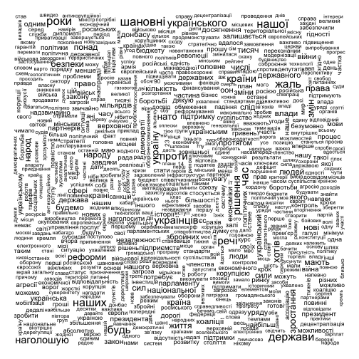

---
title    : Семантичний аналіз Corestone
substitle: Набір візуалізацій та метрик на прикладі послання Петра Порошенка до Верховної Ради
author   : Роман Кириченко
job      : Data scientist
widgets  : [mathjax, quiz, bootstrap, interactive] # {mathjax, quiz, bootstrap}
ext_widgets : {rCharts: [libraries/nvd3, libraries/leaflet, libraries/dygraphs]}
mode : selfcontained # {standalone, draft}
logo: logo.png
output: 
  ioslides_presentation:
    css: st.css

--- #id3 bg:url(assets/css/slide.svg)

## Основні візуалізації та метрики

**Матеріал:** послання Петра Порошенка до Верховної Ради 2014-2017

**Візуалізації та метрики:**
- Wordcloud
- Comparison cloud
- Correspondence analysis
- Correlation analysis
- Кількість слів
- Вода
- Нудота
- Найвживаніші слова за частинами мови

--- &twocol w1:60% w2:40% #id1 bg:url(assets/css/slide.svg)
## Wordcloud

*** =left

*** =right
Найпоширеніший варіант семантичної візуалізації. В її основі - частота вживання слів у тексті передана через розмір слів у графіку. Від них відмінусовано так звані стоп-слова.

Це чисто описова статистика. Її можна використовувати завжди.
Переваги: простота для розуміння і статус вже усталеної звичної форми візуалізації.
Недоліки: мала аналітична цінність, важко виловити інсайд. Найбільшими виходять майже завжди слова, які нам дають мало інформації про особливості тексту. До того ж ці слова часто досить нейтральні.

--- &twocol w1:40% w2:60% #id2 bg:url(assets/css/slide.svg)
## Comparison Cloud 

*** =left

*** =right

Ідея цієї візуалізації схожа до кореспонденс аналізу - порівняння відмінності семантик за певними групами. Ця візуалізація акуратніше розміщує слова на візуалізації, однак мало повідомляє про ступінь різності чи схожості семантик.
Її можна застосувати в тих випадках, коли для аналізованих текстів є якась групуюча змінна. Наприклад, персона, автором яких вона є.
**Переваги:** дозволяє показати найбільш схожу і відмінну семантику за групами.
**Недоліки:** рівномірне розміщення слів на графіку. З точки зору візуалізації виходить акуратніший графік, однак з нього неможливо судити про ступінь відмінності семантик. Точки груп на графіку автоматично робляться рівновіддаленими одне від одної.

--- &twocol w1:40% w2:60% #id4 bg:url(assets/css/slide.svg)
## Correspondence analysis

*** =left

*** =right

Порівняно з попередньою візуалізацією тут можна виміряти семантичну дистанцію між групами.
Випадки застосування аналогічні до Сomparison Cloud.
**Переваги:** як вже було сказано вище - можливість виміряти дистанцію між групами, більш точно картографувати семантичне поле. 
**Недоліки:** через точне картографування дуже часто виникають ситуації, коли слова перебувають в одній точці на візуалізації і накладаються одне на одного. Необхідно додатково проводити роботу в ілюстраторі.

--- &twocol w1:40% w2:60% #id5 bg:url(assets/css/slide.svg)
## Correlation analysis

*** =left

*** =right

**Кореляційний аналіз** і побудова на його основі графів. Можна будувати графи між найбільш згадуваними словами, як тут. Так і між конкретно обраними словами. Наприклад, можна поглянути, які слова найчастіше стоять зі словом Росія, і які в свою чергу стоять близько із цими словами і т.д.

--- &twocol w1:40% w2:60% #id6 bg:url(assets/css/slide.svg)
## Correlation analysis 2

*** =left

*** =right
Приклад найбільших кореляцій з обраним словом.
Найбільш варіативна візуалізація, оскільки кореляцію можна вимірювати за різним принципом. На цьому графіку її виміряно за принципом сусідства слів. Можна міряти сусідство за реченнями (тобто факт зв'язку між словами встановлюється тоді, коли вони перебувають разом в одному реченні).
**Переваги:** дозволяє відслідкувати типові словесні конструкції мовця, автора. 
**Недоліки:** часто ці конструкції є шаблонними, типовими, а тому і малоінформативними (у цьому випадку приклад - "шановні народні депутати". Цей недолік можна усунути, обравши першого члена кореляційної пари самостійно, як на другій візуалізації зі словом "Росія".

--- &twocol w1:40% w2:60% #id7 bg:url(assets/css/slide.svg)
## Вода

*** =left

|  Рік| Загалом слів| Унікальних слів|Вода   |
|----:|------------:|---------------:|:------|
| 2014|         3838|            1928|62.01% |
| 2015|         7652|            3533|63.11% |
| 2016|         5951|            2793|63.05% |
| 2017|         9410|            4043|64.1%  |
*** =right

**Вода** - співвідношення значущих слів (всі слова, крім другорядних членів мови) до всіх слів. Норма води 65%.

З цих показників можна судити, наскільки лексично різноманітним був виступ. 
Цей показник теж можна застосувати в усіх випадках.
**Переваги:** показник показує інформатиність тексту, виступу.
**Недоліки:** його незручно візуалізувати. У нас було чисто дизайнерське рішення - малювати стовпчикову діаграму у вигляді склянки води.

--- &twocol w1:40% w2:60% #id8 bg:url(assets/css/slide.svg)

## Нудота документу

*** =left

**Класична**

|  Рік| Нудота|
|----:|------:|
| 2014|   5.20|
| 2015|   5.92|
| 2016|   5.20|
| 2017|   6.71|

**Академічна**

|  Рік|Нудота |
|----:|:------|
| 2014|2.82%  |
| 2015|2.05%  |
| 2016|1.89%  |
| 2017|2.09%  |

*** =right
З цих показників можна судити, наскільки лексично різноманітним був виступ.

**Класична нудота** - корінь квадратний найбільш згадуваного в тексті слова:
$$\sqrt{word_{max(n)}}$$

**Академічна нудота** - відсоток частоти згадування топ-5 найбільш згадуваних слів в тексті.

$$\frac{word_{max(n)}}{\sum word}$$

Застосовувати можна завжди.
**Переваги:** обидва показники характеризують концентрацію мовника, автора на певній семантиці.
**Недоліки:** ці показники більше актуальні для СЕО і наповнення контентом сайтів, оскільки показують релевантність статті певній темі, чи потрібно політику у виступі дотримувати чіткої теми, чіткого посилу - відкрите питання. До того д показник класичної нудоти не зважується розміром тексту (чим більше текст, тим більше він буде).

--- &twocol w1:40% w2:60% #id9 bg:url(assets/css/slide.svg)

## Топи за частинами мови

*** =left

|  Рік|дієслово  |іменник |прикметник |
|----:|:---------|:-------|:----------|
| 2014|маємо     |україни |нашої      |
| 2015|будемо    |україни |минулого   |
| 2016|наголошую |україни |народні    |
| 2017|наголошую |україни |інших      |

*** =right

Ідея - показати найбільш вживані слова за частинами мови.
Можна застосувати до будь-якого тексту.
По суті це спроба більше аналітизувати Wordcloud.
**Переваги:** більша інформативність порівняно з хмарою слів.
**Недоліки:** в топи, як і у випадку хмари слів, вибиваються "нейтральні" слова.

